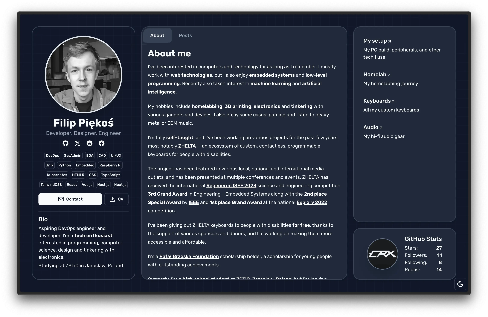

<h1 align="center">
  
  Filip Piękoś's Portfolio
</h1>
<p align="center">
  <a href="https://filippiekos.com" target="_blank">filippiekos.com</a> - my personal portfolio website and blog
</p>

<p align="center">


</p>
<p align="center">


</p>

## Features
- Built with Next.js, TailwindCSS, shadcn/ui and MDX
- Bento grid layout portfolio with a focus on performance and accessibility
- Dynamically generated blog posts and articles from markdown files

## Run locally

```bash
git clone https://github.com/XXCoreRangerX/filippiekos.com.git
cd filippiekos.com
pnpm i
pnpm run dev
```
